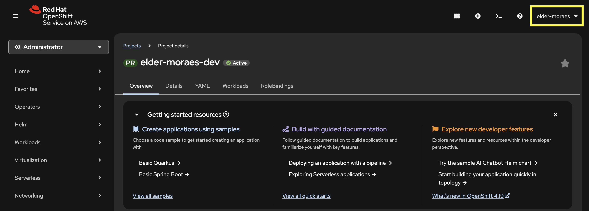

# Step 01 - Deploying to Kubernetes

## Welcome to Section 3: Deploying to Kubernetes

Congratulations on completing Section 1 and/or 2! You've learned how to build AI-infused applications with chatbots, RAG patterns, and function calling, and/or also autonomous AI agents that can work together to solve complex, multi-step problems.

In **Section 3**, we're shifting gears to learn how to deploy our AI-infused applications to a Kubernetes instance. Thanks to the Kubernetes-Native approach used by Quarkus, this will be a super easy task.

### What You'll Learn

In this step, you will:

- Add the right extensions that will allow our services to be deployed to Kubernetes
- Create health check endpoints using MicroProfile Health Check extension
- Learn how to work with the `application.properties` file so you can have a `kubernetes.yml` file configured automatically
- Deploy our services using one single command line

---

## The Scenario: Simple RAG based AI service

This section is based on the AI service created at the `Section 1/Step 5`, pointing to the OpenAI API service (mandatory at this point).

We are doing this way so we can have less moving parts and focus on Kubernetes deployment. But, of course, you are encouraged to expand it as you like.

---

## Prerequisites

Before starting, ensure you have:

- Completed at least Section 1 until Step 5 (or you are familiar with Quarkus LangChain4j basics)
- JDK 21+ installed
- OpenAI API key set as `OPENAI_API_KEY` environment variable
- - **Podman or Docker** – see [Podman installation](https://podman.io/getting-started/installation){target="_blank"} or [Docker installation](https://docs.docker.com/get-docker/){target="_blank"}
    - If you use Podman, we recommend [Podman Desktop](https://podman-desktop.io/docs/installation){target="_blank"} for easier container management.
- **OpenShift Developer Sandbox** – [provision your instance](https://developers.redhat.com/developer-sandbox){target="_blank"}
    - Click “Start your sandbox for free” and follow the instructions
    - When you see a list of Red Hat products to try on Sandbox, choose “OpenShift”
- **OpenShift Command Line Interface (CLI)** – [follow the instructions](https://developers.redhat.com/learn/openshift/download-and-install-red-hat-openshift-cli){target="_blank"} after provisioning your Sandbox account
- **kubectl** – [Download and install](https://kubernetes.io/docs/tasks/tools/#kubectl){target="_blank"}
- **Docker Hub Account** - [Register here](https://hub.docker.com/){target="_blank"}

---

## Running the Application

Navigate to the `section-3/step-01` directory and start the application:

=== "Linux / macOS"
    ```bash
    cd section-3/step-01
    ./mvnw quarkus:dev
    ```

=== "Windows"
    ```cmd
    cd section-3\step-01
    mvnw quarkus:dev
    ```

Once started, open your browser to [http://localhost:8080](http://localhost:8080){target="_blank"}.

Do it just to make sure that you application is working properly and that you OpenAI API Key is properly configured. 
If so, you can stop your application (CTRL+C) so we can work on it. 

### Adding the Kubernetes and Jib extensions

Here we’ll be using the Quarkus Kubernetes extension to create the Kubernetes deployment file, and the Quarkus Jib Extension to create and push the container image to your container registry without the need of a local Podman/Docker instance.

```shell
./mvnw quarkus:add-extension -Dextensions="quarkus-kubernetes,quarkus-container-image-jib"
```

- Kubernetes extension: offers the ability to automatically generate Kubernetes resources based on defaults and user-supplied configuration
- Container Image Jib: is powered by [Jib](https://github.com/GoogleContainerTools/jib){target="_blank"} for performing container image builds. The major benefit of using Jib with Quarkus is that all the dependencies (everything found under target/lib) are cached in a different layer than the actual application, making rebuilds really fast and small (when it comes to pushing). Another important benefit of using this extension is that it provides the ability to create a container image without having to have any dedicated client side tooling (like Docker) or running daemon processes (like the Docker daemon) when all that is needed is the ability to push to a container image registry.

---

## Adding the configuration properties

Add the following properties to your `src/main/resources/application.properties` so that you can push the container to the correct location:

```properties title="application.properties"
--8<-- "../../section-3/step-01/src/main/resources/application.properties:container-image"
```

Let's understand these properties:

- quarkus.container-image.registry: the containers registry where we'll host our images. Here we are using Docker Hub, but it could be any other one. 
- quarkus.container-image.group: your account name at Docker Hub (or at the registry that you chose).
- quarkus.container-image.name: the name of your application/deployment.
- quarkus.container-image.tag: version tag.
- quarkus.kubernetes.service-type: the service type at Kubernetes cluster. If you have access to a full Kubernetes cluster, you can use `load-balancer`. In our case, using Openshift Developer Sandbox, we'll use `ClusterIP` and then expose it for external access (more about it in a bit).
- quarkus.kubernetes-client.trust-certs: for demo purposes, we are using self-signed certs, so we need to trust them.

!!! important "User your own configurations"
    Change `docker.io` to your container registry (if using another one) and `eldermoraes` to your own account. If you don’t, your push ==will fail==.

---

## Authenticating to the registry and connecting to the Kubernetes cluster

In order to push the container image, you need to authenticate to your container registry:

```shell
podman login docker.io
```

We need also to connect our terminal to our remote Kubernetes instance on Openshift Developer Sandbox. 
Open your instance dashboard and click on your username, which is in the top right corner of the screen:



Pay attention at the yellow box in the top right corner: you'll see your username at the platform. When you click it, you'll see this:


- Click the "Copy login command" option. 
- It will open another page with a "Display Token" link; click it.
- It will open a page like this:


Copy the command under the "Log in with this token" label. 
This command needs to be executed on your terminal. It will be something like this:

```shell
oc login --token=sha256~[YOUR TOKEN] --server=https://api.[YOUR INSTANCE].openshiftapps.com:6443
```

After execution, expect to see this:

```Bash title="Example Terminal Output"
Logged into "https://api.[YOUR INSTANCE].openshiftapps.com:6443" as "elder-moraes" using the token provided.

You have access to the following projects and can switch between them with 'oc project <projectname>':

  * elder-moraes-dev
    openshift-virtualization-os-images

Using project "elder-moraes-dev".
```

If you got here, you are ready to deploy your application to Kubernetes.

## Deploy the application to your Kubernetes cluster

By using the Kubernetes extension that we added before, we can deploy our application by executing one single line of command:

```shell
./mvnw quarkus:package -DskipTests -D"quarkus.kubernetes.deploy=true"
```